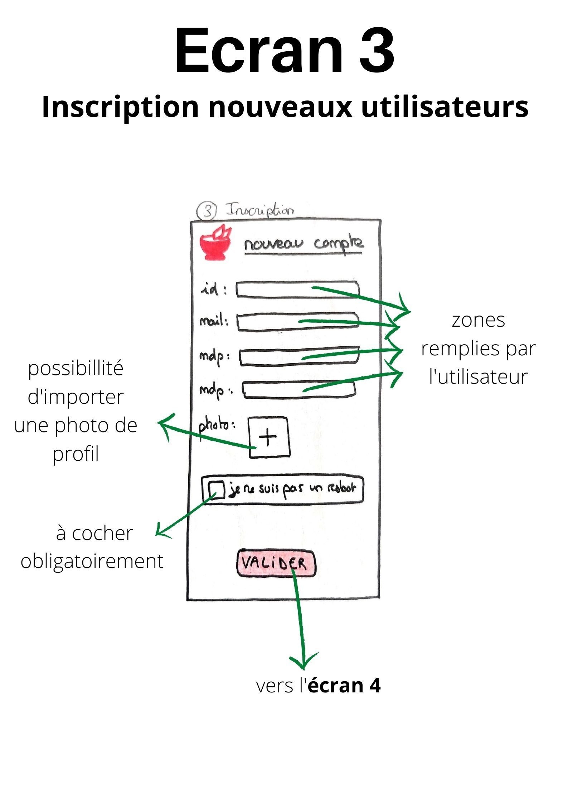

=== Interface utilisateur graphique

//   Insérer le storyboard.
//   Une description textuelle.
//   Faire le lien avec les blocks et les interfaces.

Dans cette partie, nous allons présenter les différents écrans et la manière dont on peut passer de l'un à l'autre.

Premièrement, voici une vue d'ensemble de tous les écrans dont disposera l'application. Bien sûr, ceci est dans un cas idéal et ils ne feront peut-être pas tous partie de la version finale du projet.

Ci-dessous, chaque écran est présenté plus précisément avec le détail des actions possibles à partir de celui-ci.

