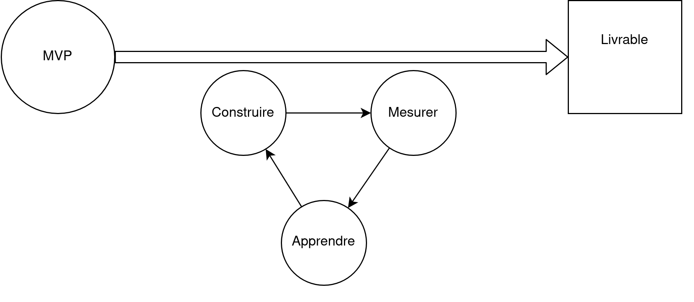
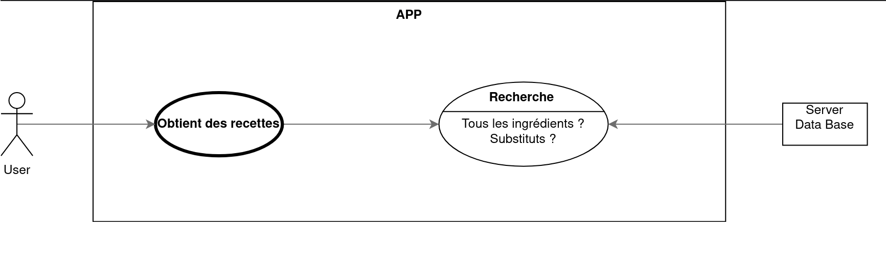
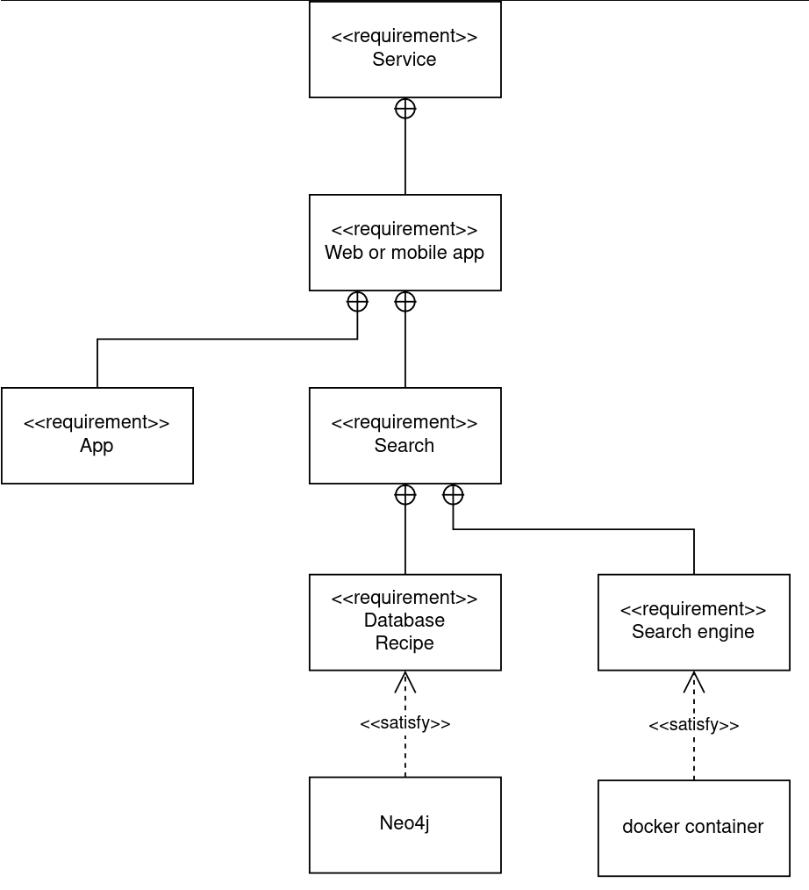
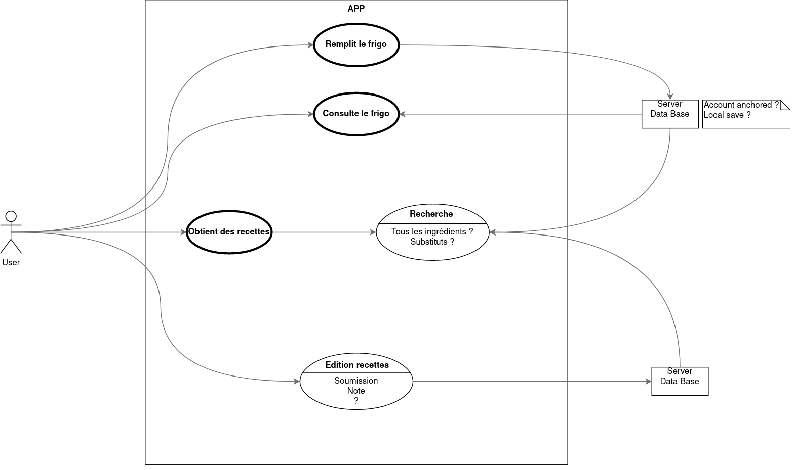
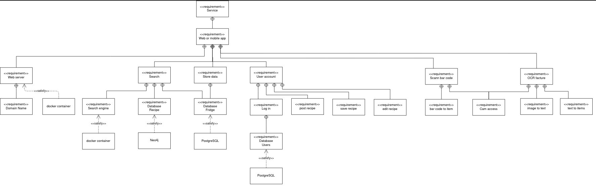
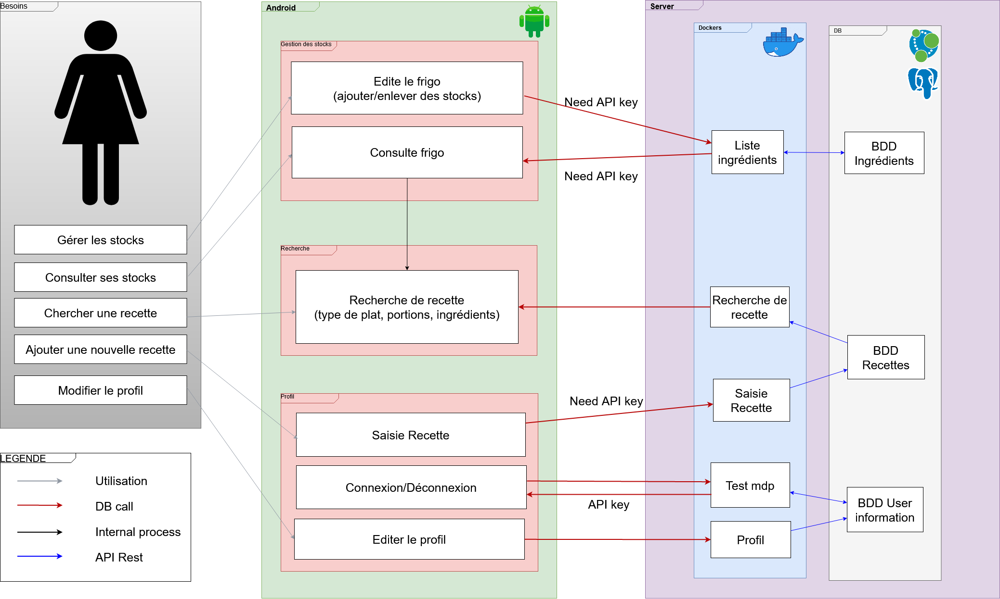
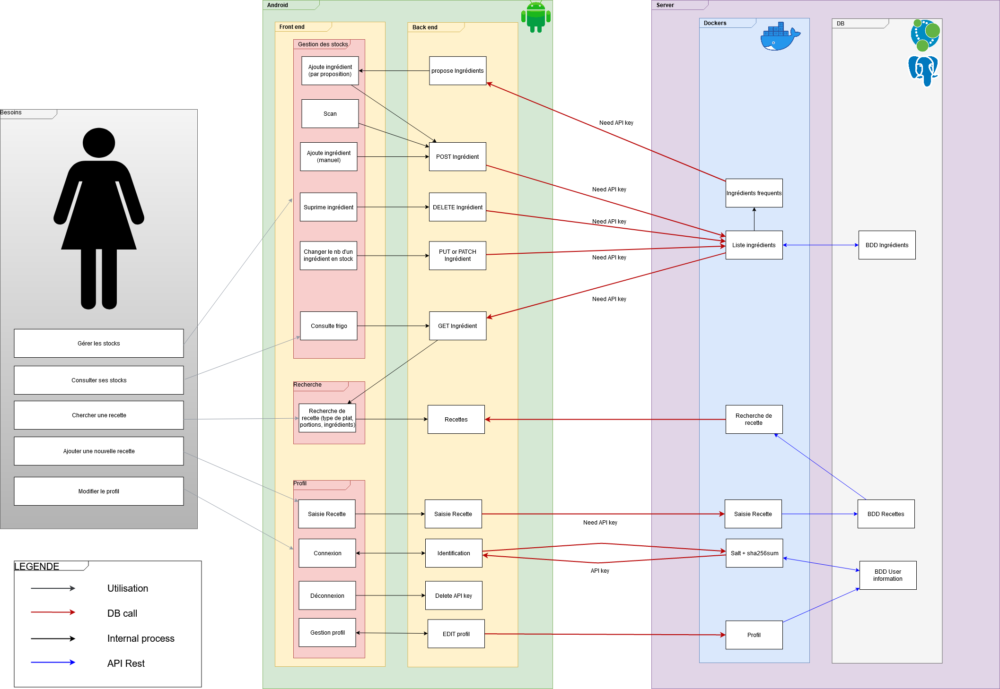

=== Schéma d’architecture

==== Organisation du développement

Pour assurer le fonctionnement de l'application, il est important d'avoir au
plus vite une application fonctionnelle. Nous nous centrerons alors sur un
modèle MVP : 'Minimum Viable Product' c'est-à-dire une application basique ne
prenant pas en compte toutes les fonctionnalités mais juste une ou deux actions
principales. Ensuite, une augmentation de chacune des parties et leur ajout sera
fait suivant la méthode LPD, 'Lean Product Development', qui est l'une des règles
principales du DevOps : Construire, Mesurer, Apprendre.

À chaque cycle, il sera d'abord décidé d'une nouvelle fonctionnalité à ajouter.
Puis, son implémentation sera testée et intégrée si elle respecte les
spécifications précisées précédemment.
Le bon fonctionnement et l'acceptation du public seront ensuite mesurés via des
métriques intégrées (built-in) dans l'application.
En fonction des résultats obtenus par ces métriques, il conviendra de réorganiser les priorités
d'implémentation pour les futurs cycles.

==== Le modèle MVP (Minimum Viable Product)
L'application se centre sur la recommendation de recettes. Elle communique avec un serveur
pour faire des recherches de recettes. Cela constituera le MVP du projet S2R.

Ci-dessous figurent les différentes exigences ("requirement") qui devront être satisfaites
pour avoir une application viable, d'un point de vue fonctionnel plus détaillé.

Il faut une application et un moteur de recherche. Ce dernier aura
accès a une base de données contenant des recettes et devra répondre aux
requêtes de l'application.

==== Les ajouts
Dans le cadre du MVP, une telle application est trop minimale et ne suffira pas pour
répondre aux attentes des utilisateurs. Il conviendra de décider de fonctionnalités
("features") permettant de répondre au mieux et au plus vite aux demandes des usagers.

Pour l'instant, les fonctionnalités proposées sont les suivantes :

* Pouvoir sauvegarder les réserves alimentaires de l'utilisateur
* Pouvoir interagir avec les recettes (éditer, ajouter, noter, etc...)

Chacune des fonctionnalités est spécifiée ci-dessus avec une précision sur les
blocs à implémenter avant.

==== Description des blocs

===== Application :

Développement et déploiement de l’application sur tablette ou smartphone et
vérification de la compatibilité des appareils.

===== Base de données :

Choix et déploiement des bases de données afin de répondre aux exigences des
différentes parties du projet.

===== Classification automatique :

Développement d’un algorithme de calcul des recettes à proposer.
Développmeent d'un algorithme qui identifie les différentes classes d'ingrédients interchangeables.

===== Usages et focus group :

Étude des usages et définition des exigences en termes d’expérience utilisateur.
Ce bloc est très important et se place dans la partie "mesurer et apprendre" du
LPD.

===== Intégration et tests :

Mise en communication de toutes les parties, déploiement d’un environnement de
test. Spécification technique de chaque bloc et de ses conditions
d'intégration.

==== Diagramme d'architecture (non exhaustif) :

Ci-dessus se trouve un diagramme d'architecture non exhaustif qui récapitule l'ensemble des fonctions de
base et les flux de données.
Les modules distincts sont répartis sur le diagramme par grand bloc:

- Du côté du serveur, les modules "Classification automatique" et "Bases de données" (qui concerne également
la communication entre client et serveur représentée par des flèches rouges)
- Du côté du client Android, les modules "Android" (avec interface graphique), "UI Web" et "Ergonomie" car ceux-ci
participent à une expérience utilisateur conviviale.
- Le module "Tests et intégrations" sur l'ensemble du projet

==== Diagramme d'architecture (exhaustif) :

Ci-dessus se trouve un diagramme d'architecture plus détaillé sur le fonctionnement de l'application.
Ce diagramme plus lourd fournit davantage de détails sur l'architecture du client de l'application.
Les modules impliqués ne changent pas par rapport au diagramme précédent.