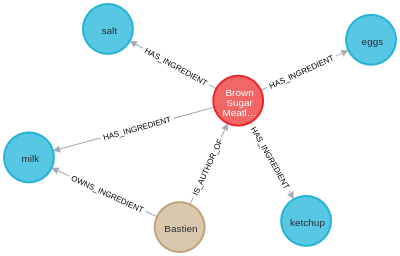

=== Module BDD
Le cœur d’une application de recommandation de recettes est bien sûr la base de données qui contient les données sur les ingrédients, les recettes et les utilisateurs. Dans ce cadre d’utilisation, malgré quelques essais en MySQL pour les utilisateurs, nous avons opté de tout stocker avec une base de données en graphe car les données sont très connexes entre elles. Nous avons donc choisi d’utiliser neo4j pour pouvoir manipuler les modèles d’utilisateurs, de recettes et d’ingrédients ainsi que les différentes relations entre eux.

==== Architecture
Du temps a été consacré pour concevoir l’architecture de la base de données. Après consensus, nous avons décidé d’utiliser trois modèles, dotés de leurs différentes propriétés et reliés entre eux par différentes relations.
Les modèles sont:
User (dont les propriétés sont username, email, password)
Ingredient (dont l’unique propriété est name)
Recipe (dont les propriétés sont title, provenance, …)
Ces données sont en effet très connexes car il existe de nombreuses relations entre ces modèles, utiles à toutes les fonctionnalités de l’application. Par exemple, une recette est reliée aux ingrédients qu’elle utilise : ces relations sont elles-mêmes dotées de propriétés qui donnent des informations sur la quantité et le traitement de l’ingrédient. Un autre exemple central à l’application serait la relation qui lie un utilisateur et les différents ingrédients qu’il possède : la propriété de la relation donne des informations sur la quantité qu’il possède.

Voici un aperçu des entités et de leur relations dans la base de données en graphe :

==== Conteneurisation
Nous avons tout d’abord cherché à trouver un moyen d’héberger une base de données. Pour tester localement les modèles et les fonctions, nous avons d’abord utilisé une base de données lancée localement sur un container Docker.
En effet, la conteneurisation de base de données (et de chaque module en général) fournit de nombreux avantages, car elle permet de vérifier l’intégrité du projet en partant d’un environnement présupposé vierge.
De plus, cela permet de tester en conditions (presque) réelles de différentes fonctions qui effectuent des requêtes depuis une API qui communique entre le serveur et le client. Les seules différences avec les conditions réelles sont l’adresse de la base de données et les données utilisées (un nombre très réduit de données a été utilisé pour effectuer les tests rapidement, alors que les données utilisées dans la production sont obtenues par scraping).
La base de données de test à données réduites peut être initialisée de façon automatisée à l’aide d’un script python qui effectue la requête Cypher.
https://neo4j.com/developer/docker/

==== Backend
Pour faire en sorte que la base de données soit en mesure de communiquer avec les modules du côté du client, il faut les interfacer entre eux. Pour ce faire, nous avons réalisé une API entre les modules BDD - Web et BDD - Android (la même API est partagée par les deux front ends).
Cette API, montée à base de Flask RESTful sur Python, fonctionne à base de requêtes HTTP envoyées sur son adresse avec des objets JSON. Elle comprend un catalogue exhaustif de routes, chacune associée à une certaine fonction qui effectue un traitement (ajout ou modification) ou une simple lecture sur la base de données.
Parmi ces fonctions, nous avons notamment:
===== Authentification:
login
register
===== Utilisateur
profile
...

===== Recettes et ingrédients
recipe
ingredient
addrecipe
addingredient
addingredientforuser

Cette API est un outil d’encapsulation qui permet aux front ends de travailler avec les données qu’elles peuvent obtenir, sans avoir à connaître le fonctionnement et l’architecture de la base de données (et réciproquement, le module BDD n’a pas besoin de connaître le fonctionnement du front end pour pouvoir travailler). Certains compromis ont dû être faits à cause de soucis techniques, mais les changements liés à ces compromis sont mineurs.
Le backend a été le plus laborieux à tester car par souci d’encapsulation et d’opacité, les fonctions sont séparées sur plusieurs fichiers. Il est facile de localiser une erreur, mais parfois très difficile de la régler.

Toutes nos recettes proviennent de jeux de données libre de droit trouvés sur Kaggle. Nous avons "parser" ces données pour distinguer : ingrédients, quantités, unités, etc. et fait beaucoup de nettoyage de données.

Nous avons également passé un certain temps sur l'optimisation des requêtes, tant en termes de performances (durée) que d'ergonomie (listage des ingrédients par fréquence d'utilisation, etc.)

Voici un exemple de requête écrite pour la BDD graphe (récupérer les unités pertinentes pour un ingrédient :
----
MATCH (i:Ingredient)<-[h:HAS_INGREDIENT]-(:Recipe)
WHERE id(i)={id}
RETURN DISTINCT h.unit AS units ORDER BY size(h.unit) DESC
----

https://flask-restful.readthedocs.io/en/latest/
https://neo4j.com/docs/api/python-driver/current/index.html
https://stackabuse.com/single-page-apps-with-vue-js-and-flask-restful-api-with-flask/
