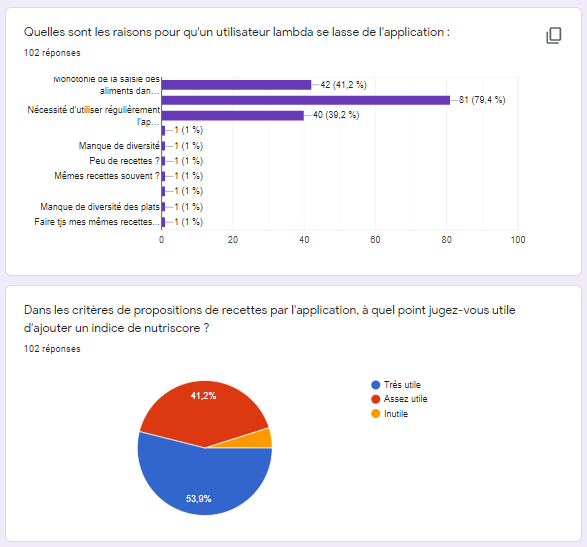
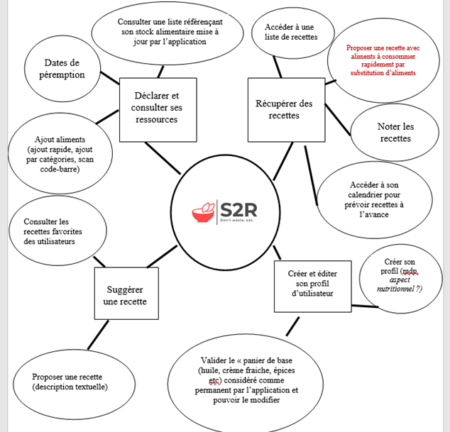

=== Documentation du module SES

==== Ressources bibliographiques consultées :

•	Ouvrage de référence :  Quand manger fait société, Philippe Cardon, 2017, Edition Septentrion 
•	Second ouvrage de référence : La meilleure façon de manger, Thierry Soucart et Angélique Houlbert, 2008

==== Méthodologie employée :

•	Réalisation d’un sondage préliminaire : échantillon de plus de 100 personnes, sondage réalisé avec l’outil Google Form. Les questions portent sur l'intérêt pour l'application, le public visé, les modes d’ajout d’ingrédients, les problèmes liés à une utilisation régulière de l’application et la gestion des dates de péremption. 
Le sondage nous a permis de définir la cible privilégiée : les jeunes, les étudiants et les cuisiniers débutants. Nous avons adopté une ergonomie simplifiée pour le site Web et l’application Android en conséquence.

==== Exemple de résultat à une question posée : 

•	Interview de cuisinières expérimentées : 3 cuisiniers interviewés, transcription de leurs interviews. Nous en tirons des conclusions sur la gestion des restes et des dates de péremption, qui viendraient aider un développement ultérieur du projet.

•	Réalisation d’une Mindmap des services de l’application: pour nous aider à cibler les fonctionnalités importantes de l’application.

==== Rédaction du rapport SES :

Nous avons mené une réflexion sur l’usage en évolution de notre projet avec la crise sanitaire :  difficulté pour manger à l’extérieur, les jeunes et leurs économies sont les plus affectés par la crise sanitaire. Nous y avons aussi détaillé la méthodologie utilisée pour guider le projet : sondage préliminaire, transcription d’interviews, chronologie des moments forts etc. Enfin, nous avons analysé les résultats : résultats attendus et obtenus, renoncements et résultats inespérés.

==== Test d’ergonomie de l’application :

Nous avons fait tester le site Web et l’application Android à nos proches. Les tests ne sont pas guidés, nous les laissons réaliser les actions sans aide de notre part pour vérifier la facilité qu’ils ont à accéder aux différentes fonctionnalités de l’application. 
Ces retours sont ensuite transmis aux modules Android et Interface Web pour proposer des pistes d’amélioration.

