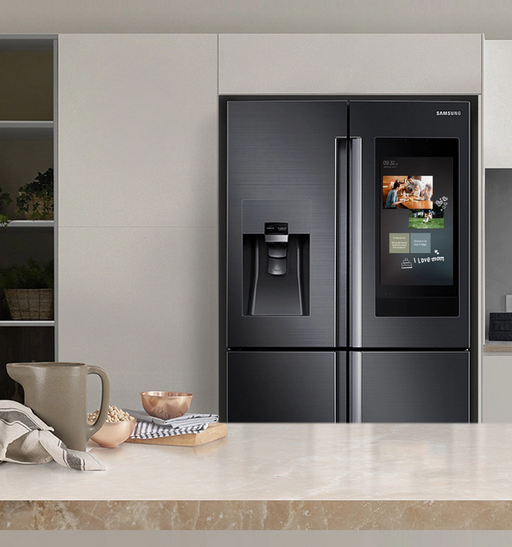
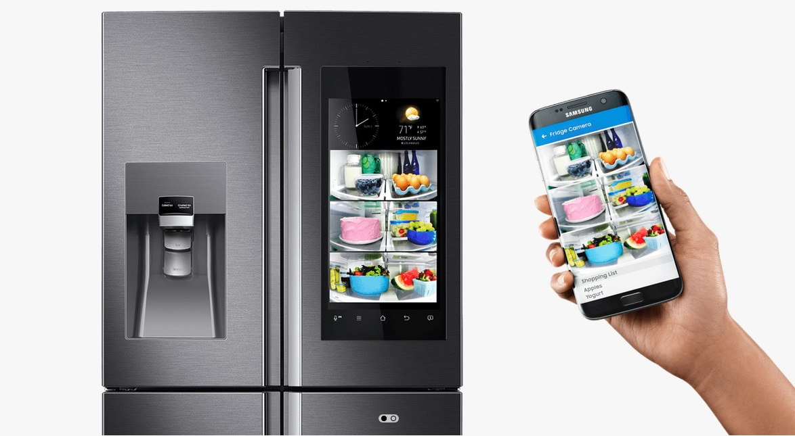

=== Description de la proposition

L'expertise culinaire n'est pas garantie à tous. Par faute de simplicité et d'ingrédients, les recettes en ligne
deviennent rapidement difficiles à suivre à la lettre.

En effet, dans notre groupe, plusieurs personnes utilisent ou souhaitent utiliser davantage des applications de
recommandation de recettes. Ces applications (Marmiton, Tasty, 750g, ...) comptent plusieurs dizaines de millions
d'utilisateurs. Néanmoins, ces applications nécessitent quasiment systématiquement de racheter des ingrédients.
En outre, les utilisateurs de ce genre d'applications ne sont pas toujours de grands cuisiniers. Or, adapter les
ingrédients d'une recette demande des compétences et connaissances en cuisine : rôle d'un ingrédient
(liant, texture, ...), mariage des goûts etc.

Ces applications sont donc peu pratiques pour cuisiner "sur le pouce", et incite les utilisateurs à surconsommer et
à gaspiller. Cette problématique n'est pas négligeable car les chiffres du gaspillage alimentaire en France sont
alarmants: aujourd'hui, 10 millions de denrées alimentaires perdues ou gaspillées en France par an. Selon Statista <<Statista>>,
il s'agit d'une valeur de 16 milliards d'euros, et l'impact carbone de ces pertes serait évalué à 15 millions de tonnes.
Les générations plus jeunes, davantage sensibilisées aux enjeux du développement durable, cherchent encore
une solution convenable à cette problématique.

Cependant, les différentes réponses au problème logistique et culinaire ne sont pas toujours conformes aux contraintes
ergonomiques et budgétaires.

Considérons par exemple le réfrigérateur connecté <<RefrigerateurConnecteBoulanger>>. Non seulement un tel réfrigérateur sera connecté au
smartphone et donc capable de lire du contenu multimédia, il sera capable de consulter l'agenda de l'utilisateur,
de réguler sa température à distance, consulter les actualités... mais en particulier, le réfrigérateur interactif
peut gérer les réserves alimentaires de l'utilisateur ainsi que leur date de péremption. En effet, le produit propose
à l'utilisateur des recettes pour inciter à consommer ses stocks avant leur péremption, plutôt qu'à en racheter de
nouveaux.

Une solution certes brillante, si ce n'était pas pour son prix exorbitant, car le réfrigérateur interactif coûte de
quinze à vingt fois plus cher que le réfrigérateur classique.

<<SamsungFamilyHub>>

Le noyau du projet de SuppliesToRecipe, abrégé S2R, repose sur la même idée pour en faire un modèle de consommation
beaucoup plus accessible tout en restant peu onéreuse, voire gratuite. Dans ce modèle, plutôt qu'aller chercher les
ingrédients en fonction des plats cuisinés, les recettes viendront à l'utilisateur en fonction de ses réserves.

L'idée principale est donc de développer une application qui, dans ce nouveau modèle décisionnel, pourra effectuer
ce travail logistique à la place de l'utilisateur comme le ferait un réfrigérateur connecté. Elle fournira des recettes
depuis sa base de données en fonction de la disponibilité des ingrédients et de leur date de péremption.

Des applications promettent de répondre à ce problème (quecuisiner.fr <<QueCuisiner.fr>>, Frigo Magic <<FrigoMagic>>, ...).
Mais elles contournent les problèmes de compétences plutôt que de le résoudre, et souffrent de la limitation du nombre de
recettes dans leurs bases de données, de sorte qu'il est fréquent de ne pas trouver de recettes adaptées au contenu de son frigo.
Il est également pénible de devoir saisir un à un la liste des ingrédients de notre frigo dans ces applications.

Notre application promet donc de résoudre ces trois problèmes : manque de souplesse des recettes, gaspillage et pénibilité de la saisie des ingrédients.

Pour cela, nous créerons de zéro une application de recommandation de recette contenant :

* une saisie des stocks très rapide et peu pénible (lecture automatique de tickets de caisse, liste d'ingrédients usuels...) ;
* la gestion des dates de péremption des ingrédients ;
* un algorithme d'adaptation des recettes existantes, quand aucune n'existe n'utilisant que les ingrédients du frigo (intelligence artificielle prenant en compte les retours des utilisateurs).
